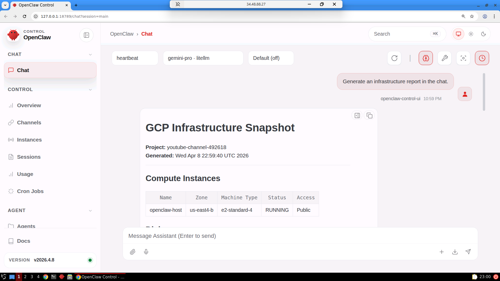
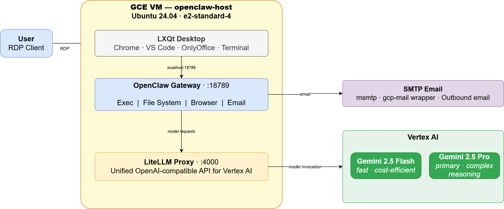

# AI Agent Workstation on GCP with OpenClaw, LiteLLM, and Vertex AI

This project delivers a fully automated **AI agent workstation** on Google Cloud
Platform, built using **Terraform**, **Packer**, and **OpenClaw** — an agentic
coding and task automation platform backed by **Vertex AI** Gemini models via a
**LiteLLM proxy**.

It provisions a **GCE instance** running **Ubuntu 24.04** with a full **LXQt
desktop environment** accessible over **RDP**, pre-loaded with developer
tooling, cloud CLIs, and a running OpenClaw gateway — ready to accept work
from the moment you connect.

Users RDP into the desktop and interact with OpenClaw through its web interface
at `http://localhost:18789`. The agent has full access to the local filesystem,
terminal, browser, and GCP services via the VM service account — no credentials
to manage, no keys to rotate.



OpenClaw is backed by two **Vertex AI** Gemini models available for selection at
runtime: **Gemini 2.5 Flash** and **Gemini 2.5 Pro** — both routed through a
locally running **LiteLLM proxy** so the agent works with any model without
configuration changes.

Outbound **email** is configured automatically at boot using **SMTP credentials**
retrieved from Secret Manager, giving the agent the ability to send reports,
notifications, and file attachments without any manual setup.

---

## Key Capabilities Demonstrated

1. **Autonomous AI Agent** — OpenClaw operates as a fully autonomous coding
   and task agent. It can write and execute code, browse the web, manipulate
   files, call GCP APIs, and send email — all driven by natural language
   instructions.
2. **Vertex AI Model Integration** — Two Gemini models (2.5 Flash and 2.5 Pro)
   are available via LiteLLM proxy running on loopback. Model selection requires
   no code changes — switch at any time in the OpenClaw UI.
3. **Fully Automated Provisioning** — A single `apply.sh` command provisions
   the VPC, builds the GCE image with Packer, and deploys the VM with Terraform.
4. **Zero Credential Management** — The GCE instance authenticates to Vertex AI
   and Secret Manager through its service account with `cloud-platform` scope.
   No access keys are stored on disk or in code.
5. **Pre-Configured Desktop Environment** — LXQt desktop with Google Chrome,
   Visual Studio Code, OnlyOffice, a file manager, and terminal — all ready on
   first login.
6. **Integrated Email via SMTP** — msmtp is configured system-wide at boot
   using credentials from Secret Manager. The agent can send plain text email,
   HTML email, and file attachments using the `gcp-mail` wrapper.
7. **Infrastructure as Code** — Terraform manages all GCP resources across
   three phases (core networking, image build, VM host) in a fully repeatable,
   auditable way. Packer builds the image from a clean Ubuntu 24.04 base with
   no dependencies on a pre-built image.

---

## Architecture



The deployment spans three Terraform phases backed by a Packer image build.
**01-core** establishes the network foundation — a VPC, subnet, Cloud Router,
NAT gateway, and Secret Manager secrets for credentials and SMTP. **02-packer**
builds the `openclaw-images` family image from a clean Ubuntu 24.04 base,
installing the full LXQt desktop, developer tooling, and the OpenClaw and
LiteLLM services. **03-openclaw** launches the GCE instance from that image,
attaches the service account for credential-free access to Vertex AI and Secret
Manager, and runs `startup.sh` at first boot to wire everything together.

At runtime, the user connects via RDP to the LXQt desktop and opens OpenClaw
in Chrome. Prompts flow from the OpenClaw gateway to the LiteLLM proxy running
on loopback, which routes model requests to Vertex AI — keeping all inference
traffic within GCP. The service account handles authentication throughout, so
no access keys ever touch the filesystem.

## Key Resources

| Resource | Value |
|---|---|
| Default region | `us-east4` |
| Default zone | `us-east4-b` |
| VPC | `openclaw-vpc` |
| Subnet | `openclaw-subnet` |
| Instance name | `openclaw-host` |
| Machine type | `e2-standard-4` (variable) |
| Image family | `openclaw-images` |
| LiteLLM port | `4000` (loopback) |
| OpenClaw gateway port | `18789` (loopback) |
| Primary AI model | `gemini-2.5-flash` (Vertex AI) |
| Secondary AI model | `gemini-2.5-pro` (Vertex AI) |
| Linux user | `openclaw` |
| Password source | Secret Manager `openclaw-credentials` |
| SMTP credentials | Secret Manager `openclaw-smtp` |

---

## Prerequisites

* [A GCP Account](https://console.cloud.google.com/)
* A GCP service account key (`credentials.json`) placed in the project root
* [Install gcloud CLI](https://cloud.google.com/sdk/docs/install)
* [Install Terraform](https://developer.hashicorp.com/terraform/install)
* [Install Packer](https://developer.hashicorp.com/packer/install)
* [Install jq](https://jqlang.github.io/jq/download/)
* An RDP client (Windows built-in, macOS Microsoft Remote Desktop, or Remmina on Linux)

### Enable Required APIs

Run `api_setup.sh` once before deploying to enable all required GCP APIs:

```bash
./api_setup.sh
```

This enables: Compute, Resource Manager, Secret Manager, Vertex AI, Cloud
Billing, and Storage APIs.

### SMTP Email (Optional)

To enable outbound email from the agent, set the SMTP variables in
`01-core/variables.tf` before running `apply.sh`:

```hcl
variable "smtp_host"     { default = "smtp.example.com" }
variable "smtp_port"     { default = "587" }
variable "smtp_username" { default = "user@example.com" }
variable "smtp_password" { default = "yourpassword" }
variable "smtp_from"     { default = "user@example.com" }
```

Terraform writes these values into the `openclaw-smtp` Secret Manager secret
during `01-core` deployment. The VM reads them at boot to configure msmtp and
the `gcp-mail` wrapper.

If the values are left at their defaults (`smtp.example.com`), SMTP is skipped
silently and the VM still boots normally.

---

## Download this Repository

```bash
git clone https://github.com/mamonaco1973/gcp-openclaw.git
cd gcp-openclaw
```

Place your GCP service account key at `credentials.json` in the project root.

---

## Build the Code

Run [check_env.sh](check_env.sh) to validate your environment, then run
[apply.sh](apply.sh) to provision all infrastructure and build the image.

```bash
./apply.sh
```

`apply.sh` performs the following steps in order:

1. Runs `check_env.sh` to validate required CLI tools and GCP authentication
2. Deploys `01-core` — VPC, subnet, NAT gateway, Secret Manager secrets
3. Runs `packer build` against `02-packer/openclaw.pkr.hcl` to produce the GCE image
4. Resolves the latest image from the `openclaw-images` family
5. Deploys `03-openclaw` — GCE instance, firewall rules, service account binding
6. Runs `validate.sh` and prints the RDP connection details

To tear down all resources:

```bash
./destroy.sh
```

> **Note:** `destroy.sh` deletes all images in the `openclaw-images` family
> before destroying the Terraform state, so no orphaned images are left behind.

---

### Build Results

When the deployment completes, the following resources are created:

- **Networking (01-core):**
  - VPC `openclaw-vpc` (custom mode, no auto subnets)
  - Subnet `openclaw-subnet` with CIDR `10.0.0.0/24` in `us-east4`
  - Cloud Router and Cloud NAT for outbound internet access
  - Secret Manager secrets: `openclaw-credentials`, `openclaw-smtp`

- **GCE Image (02-packer):**
  - Ubuntu 24.04 base image built in `us-east4-b`
  - **LXQt** lightweight desktop environment with **XRDP** for remote access
  - **Google Chrome**, **Visual Studio Code**, **OnlyOffice Desktop Editors**
  - **gcloud CLI** (pre-installed), **AWS CLI**, **Azure CLI**, **Terraform**, **Packer**, **Git**
  - **Node.js 22**, **OpenClaw** installed globally
  - **LiteLLM proxy** in a Python venv at `/opt/litellm-venv`
  - **Python tools** — python-docx, python-pptx, openpyxl, pandas, numpy,
    matplotlib, pymupdf, reportlab, beautifulsoup4, httpx, rich, and more
  - **System utilities** — ffmpeg, imagemagick, pandoc, poppler-utils,
    ghostscript, sqlite3, jq, xmlstarlet, csvkit, msmtp
  - **OpenClaw config pre-stamped** — gateway metadata written at build time
    so no cold-start config generation on first launch
  - **Exec allowlist pre-configured** — agent can run commands immediately

- **GCE Instance (03-openclaw):**
  - `e2-standard-4` instance launched from the latest `openclaw-images` image
    with a 128 GB SSD root disk
  - Ephemeral public IP assigned; port 3389 open for direct RDP access
  - Service account with `cloud-platform` scope grants access to Vertex AI,
    Secret Manager, and all GCP APIs — no keys on disk
  - **`startup.sh`** runs at first boot:
    1. Reads `openclaw-credentials` from Secret Manager and sets the
       `openclaw` Linux user password
    2. Writes `/opt/openclaw/litellm-config.yaml` with Vertex AI project ID
       and model IDs
    3. Reads `openclaw-smtp` from Secret Manager and configures msmtp and
       the `gcp-mail` wrapper for outbound email
    4. Restarts `litellm.service` and `openclaw-gateway.service`
    5. On first boot only: configures the LiteLLM model provider in OpenClaw

- **Systemd Services:**
  - `litellm.service` — LiteLLM proxy, reads `/opt/openclaw/litellm-config.yaml`
  - `openclaw-gateway.service` — OpenClaw gateway on loopback port 18789

---

## Connecting to the Instance

After `apply.sh` completes, the instance's public IP is printed by `validate.sh`.

### Direct RDP

Connect your RDP client to the instance's public IP on port `3389`.

```
Host:     <public-ip>:3389
Username: openclaw
Password: (retrieved below)
```

### Getting the Password

```bash
gcloud secrets versions access latest \
  --secret="openclaw-credentials" | jq -r '.password'
```

---

## Using OpenClaw

Once connected via RDP, the LXQt desktop loads automatically. Double-click
**Google Chrome** on the desktop — it opens to `http://localhost:18789`, the
OpenClaw web interface.

### Selecting a Model

Click the model selector in the OpenClaw toolbar. Two models are available:

| Model | Best for |
|---|---|
| **Gemini 2.5 Flash** | Fast responses, cost-efficient tasks, iteration |
| **Gemini 2.5 Pro** | Complex reasoning, multi-step coding tasks, analysis |

### Agent Capabilities

OpenClaw's `main` agent has full access to:

| Capability | Details |
|---|---|
| **Exec** | Run any shell command — bash, Python, gcloud CLI, cron, etc. |
| **File system** | Read, write, and manage files anywhere under the home directory |
| **Browser** | Open URLs, extract page content, take screenshots via headless Chrome |
| **Email** | Send plain text and HTML email via `gcp-mail` (msmtp + SMTP) |
| **GCP APIs** | Full access via the VM service account — no credentials needed |

The agent's workspace is at `~/.openclaw/workspace`. A `SYSTEM.md` file in the
workspace describes all available tools, commands, and capabilities.

---

## Demo: GCP Infrastructure Report

This demo shows OpenClaw autonomously generating a GCP infrastructure snapshot,
emailing it, and scheduling it as a nightly recurring task — using only natural
language instructions.

### What the Infrastructure Report Contains

- **Compute Instances** — name, zone, machine type, status, and access type
- **Disks** — name, zone, size, type, and status
- **Custom Images** — name, family, size, and creation date
- **Firewall Rules** — name, direction, allowed ports, and source ranges
- **Secrets** — names and creation dates
- **Networks** — VPC names and subnet counts
- **Storage Buckets** — name, location, and storage class

### Step 1 — Generate the Report

Paste this prompt into OpenClaw:

> Generate an infrastructure report in the chat.

OpenClaw will run `gcp-infra-report` via exec and display the results in the
conversation.

### Step 2 — Email the Report

Paste this prompt:

> Email that report to mamonaco1973@gmail.com.

OpenClaw will run `send-infra-report mamonaco1973@gmail.com`, which formats the
report as a styled HTML email and sends it via `gcp-mail`.

### Step 3 — Schedule it as a Nightly Report

Paste this prompt:

> Schedule that email report to run nightly at midnight.

OpenClaw will add a crontab entry to run `send-infra-report` at midnight every
day and confirm the registered schedule.

---

## Packer Build Scripts

The GCE image is built from Ubuntu 24.04 using the following scripts in order:

| Script | Purpose |
|---|---|
| `01-packages.sh` | Removes snap, installs base packages |
| `02-desktop.sh` | LXQt desktop environment |
| `03-xrdp.sh` | XRDP + LXQt session configuration |
| `04-chrome.sh` | Google Chrome Stable |
| `05-tools.sh` | Git, AWS CLI v2, Terraform, Packer, Azure CLI, gcloud, VS Code |
| `06-user.sh` | `openclaw` Linux user with passwordless sudo |
| `07-node.sh` | Node.js 22, OpenClaw global install |
| `08-litellm.sh` | LiteLLM proxy in Python venv at `/opt/litellm-venv` |
| `09-openclaw-init.sh` | Runs gateway briefly to stamp config; configures LiteLLM provider and exec allowlist; writes `SYSTEM.md` |
| `10-services.sh` | Installs and enables systemd service units |
| `11-python-tools.sh` | Python packages and system utilities for agent use |
| `12-onlyoffice.sh` | OnlyOffice Desktop Editors |
| `13-gcp-tools.sh` | `gcp-infra-report` and `send-infra-report` helper scripts |
